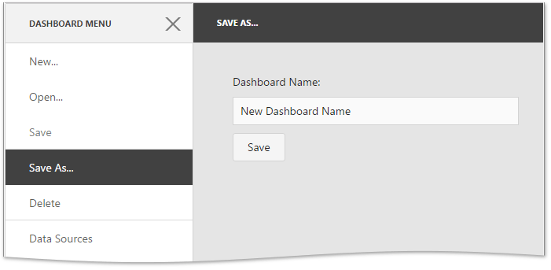

<!-- default badges list -->

<!-- default badges end -->
# Dashboard for MVC - How to implement Save As and Delete functionality by creating custom extensions

This example shows how to implement [custom extensions](https://docs.devexpress.com/Dashboard/117543) that add the "Save As" and "Delete" [menu items](https://docs.devexpress.com/Dashboard/117444) to the Web Dashboard's UI:

* The "Save As" menu item allows users to save the current dashboard with a new name.
* The "Delete" menu item deletes the opened dashboard from [dashboard storage](https://docs.devexpress.com/Dashboard/116299).

The image below shows the result of the extensions implementation:

To add this functionality to your application, [add](./CS/MVC_WebDashboard/Views/Home/Index.cshtml#L5-L6) the extension scripts to the page and [register](./CS/MVC_WebDashboard/Views/Home/Index.cshtml#L16-L17) the extensions in the control with the [DashboardControl.registerExtension](https://docs.devexpress.com/Dashboard/js-DevExpress.Dashboard.DashboardControl?p=netframework#js_devexpress_dashboard_dashboardcontrol_registerextension_extensions_) method call. 

These extensions also require server configuration.

<!-- default file list -->
## Files to look At

* [DeleteExtension.js](./CS/MVC_WebDashboard/Scripts/DeleteExtension.js)
* [SaveAsExtension.js](./CS/MVC_WebDashboard/Scripts/SaveAsExtension.js)
* [Index.cshtml](./CS/MVC_WebDashboard/Views/Home/Index.cshtml)
* [HomeController.cs](./CS/MVC_WebDashboard/Controllers/HomeController.cs#L20-L24)
* [Global.asax.cs](./CS/MVC_WebDashboard/Global.asax.cs#L18)
* [CustomDashbboardStorage.cs](./CS/MVC_WebDashboard/Models/CustomDashboardStorage.cs#L11-L15)
<!-- default file list end -->

## Documentation 

- [Integrate the Dashboard Extension into a Project](https://docs.devexpress.com/Dashboard/116420/web-dashboard/aspnet-mvc-dashboard-extension/integrate-the-dashboard-extension-into-a-project)

## More Examples

- [Dashboard for Web Forms - How to implement the Save As and Delete functionality by creating custom extensions](https://github.com/DevExpress-Examples/web-dashboard-how-to-implement-save-as-and-delete-by-creating-custom-extensions-t466761)
- [Dashboard for ASP.NET Core - How to implement the Save As and Delete functionality by creating custom extensions](https://github.com/DevExpress-Examples/aspnet-core-dashboard-how-to-implement-the-save-as-and-delete-functionality-by-creating-cu-t601084)
- [Dashboard for HTML JavaScript - How to implement Save As and Delete functionality by creating custom extensions](https://github.com/DevExpress-Examples/DashboardCoreAngularSaveAsExtension)
